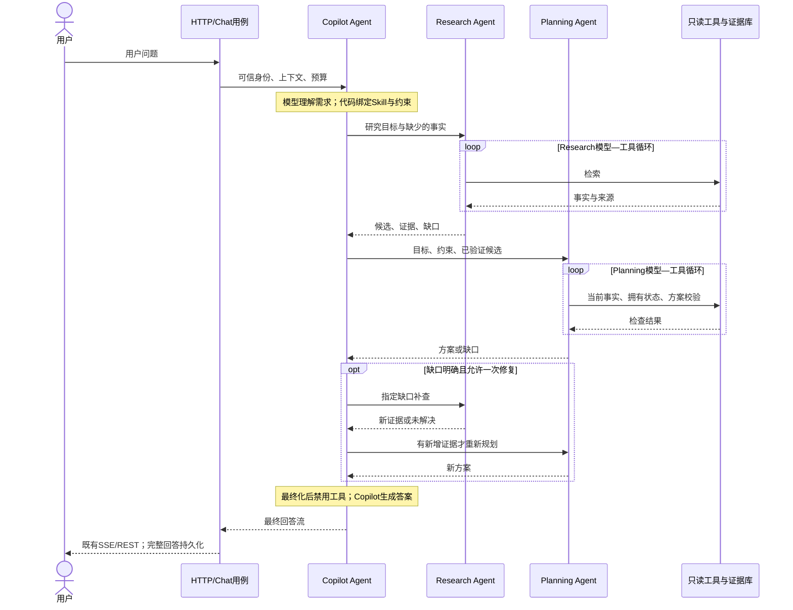

# 三 Agent 协作：Copilot 承接、Research 查证、Planning 决策

- Status: `DRAFT` — 待用户评审，未授权生产代码实现。
- Owner: red060324（需求与设计审批）；Codex（本轮 spec 起草）。
- Source: 2026-09-07 本次对话：用户明确要求保留三个真正的 Agent，说明职责、调用时机、用户输入至最终回答全流程，并在 GitHub 新建开发分支编写规范 spec。
- Branch: `codex/three-agent-collaboration`
- Base: `origin/codex/clean-architecture-refactor` @ `382892f4ff98ddd81fa603ca50a0e3d76818ab8c`；2026-09-07 fetch 后该分支仍为此 revision。`origin/master` 为较旧的 `49004fd`，本功能依赖前述架构代码；未来 PR 应先以架构分支为 base，或待其合并后 rebase。
- Mode: `FULL`
- Authority: 本目录是此开发分支唯一的三 Agent 改造 spec。批准前不改变现有运行时目标。
- Supersedes-on-approval: [高级 AI spec](../20260904-advanced-ai-architecture/spec.md) 中固定 Router → QueryPlanner → supervisor → Answer、一次性委派与相应 Agent 契约；其 LightRAG 存储、知识生命周期、只读范围、业务模块、部署等不重叠内容继续有效。
- Related: [实施设计](plan.md)、[内部契约](contracts.md)、[任务](tasks.md)、[测试计划](test-plan.md)、[阶段报告](report.md)。

## Goal / Background

现有 Copilot 向模型询问由代码基本唯一确定的 research/planning/finish；Router、QueryPlanner、Answer 分散了入口与收尾职责。Research 与 Planning 都有工具循环，但 Planning 与检索、回答的边界不够清楚。本次将用户始终面对的任务负责人收敛为 Copilot，保留两个独立 Worker Agent，让动态委派具有业务意义，而不是为展示三个 Agent 强制所有请求经过三者。

## Decisions

1. 正好三个自主业务角色，均以 Eino ADK ChatModelAgent 实现，具有各自消息上下文、指令、获准工具和有界模型—工具循环；可以复用同一个底层 chatModel，不新增服务、独立模型训练或部署。
2. Copilot 是唯一会话负责人：理解问题、提出澄清、调用 Worker、判断结果是否足够、组织最终回答。现有 Router/QueryPlanner/Answer 不再是新模式必经的独立模型节点。
3. Research 负责查询拆解和事实查证，返回候选、证据、覆盖与缺口；不生成最终推荐方案，不直接对用户回答。
4. Planning 是真正的方案 Agent，针对推荐、比较、组合、安排自主选择只读工具并观察结果、调整方案；不是单纯改写 Research 的摘要。返回选择、取舍、约束校验与不可行原因。不得降格为普通工具作为本方案的替代。
5. Eino Agent-as-Tool 为首选机制；UseCase 拥有契约、委派校验与共享预算，框架消息与 AgentTool DTO 仅留在适配层。Worker 只能返回 Copilot，不能互相委派。
6. Copilot 的回答职责包含最终化阶段；最终模型请求禁用委派和业务工具，使用同一 Copilot 角色生成回答，经既有 HTTP/SSE 返回。它不是第四个 Answer Agent。见 plan.md 的流式边界。
7. 所有能力只读。明确拒绝购买、支付、领券和社区写入；普通业务 HTTP 操作不受本次改造影响。
8. 原模式保留为显式回滚路径；新模式 opt-in。一次请求中禁止新模式失败后暗中重跑旧模式。

## Scope

### In scope

- 三角色职责、动态委派、最小上下文、结构化产物、有限补查与重新规划。
- 本轮用户约束与已有画像的优先级、来源标记、硬约束/软偏好区分。
- Skill 的确定性解析与校验、查询拆解迁入 Research、最终答案迁入 Copilot。
- 请求级/角色级预算、取消、工具权限、失败与降级、持久化和 SSE 兼容。
- 测试、版本化确定性 eval、观测、开关与回滚；同步受影响架构文档。

### Non-goals

- 不引入第四个 Router/Planner/Answer Agent；摘要仍是条件性普通模型节点。
- 不引入订单/支付/领券/社区写工具，不把推荐描述成已执行购买。
- 不改 LightRAG 原生存储，不新增数据库表、跨请求 Agent checkpoint、常驻后台 Agent 或独立微服务。
- 不做任意并发 Worker、无限反思、多 Agent 辩论、工作流编辑器或新前端进度协议。
- 不在本轮 spec 提交实现生产行为、执行付费模型验证、部署或合并。

## Role Boundaries And Invocation

| 角色 | 输入 | 决策范围 | 产物 | 禁止事项 |
|---|---|---|---|---|
| Copilot | 用户问题、必要历史/画像、可信能力目录、Worker 结果 | 澄清、委派、补查、收尾；向用户解释已验证方案 | 子任务或最终用户答案 | 任意工具扩权、自己重算/篡改已验证方案、把资料当指令 |
| Research | 目标、待查 facets、允许来源、必要上下文 | 拆解查询、选择检索工具/参数、判断证据覆盖 | 候选事实、evidenceIds、missingFacts | 最终候选排名/组合、用户对话、写业务数据、调用 Planning |
| Planning | 目标、可信约束、候选、当前 run 证据 | 比较/组合候选、调用只读事实和评分工具、调整方案 | 方案、约束结果、取舍、信息缺口 | 大范围开放检索、直接补查或发用户消息、虚构证据、交易 |

使用时机：寒暄/能力说明只用 Copilot；事实问答委派 Research；推荐/比较/安排在事实充分时委派 Planning。首次请求通常先 Research；后续轮次只有在当前 run 已重新装载并校验事实时才可直接 Planning，历史聊天里的价格或证据 ID 不能直接复用。

## Business Walkthrough

示例：“预算 200 元，选两款 PC 游戏，一款本地双人、一款单人剧情，排除已拥有，并说明理由。”这是代码目标行为推演，不是实测日志，不编造游戏或价格。

1. HTTP Entry 鉴权并传播取消；Presenter 校验 message/session；Chat UseCase 加载会话、summary、最近消息和画像，建立 run 与总预算。
2. Copilot 接收原问题和最小上下文，提议结构化目标/约束与 Skill。代码校验并绑定能力，预算只能收紧；缺币种/地区且上下文不能确定则生成澄清，结束本轮。
3. Copilot 调用 research：寻找覆盖两类玩法的 PC 候选，核验玩法和价格。它不指定虚假的结果或信任身份参数。
4. Research 内部模型选工具 → 代码检索 → 工具结果回到自己的消息历史 → 模型继续或结束。代码分配证据 ID，研究产物说明覆盖与缺口。
5. Copilot 观察结果：关键证据不足则定向补查或解释限制；足够且任务是选择方案则调用 planning。
6. Planning 的模型观察候选和约束，调用目录/拥有状态工具获取当前事实，提出组合并调用确定性方案检查；根据结果调整，返回通过验证的方案或缺口/不可行原因。
7. 缺口由 Planning 返回 Copilot。Copilot 决定是否值得查；最多一次定向修复研究和一次重新规划，受剩余预算限制。相同缺口无新增证据不能反复调用。
8. Copilot 请求 finalization，代码固定本轮结果/引用/限制并关闭全部工具；同一 Copilot 角色的最终模型请求组织回答，返回现有 SSE message 或 REST answer。
9. 只有完整结束且持久化成功的回答才视为完成；取消、流错误和持久化失败不产生伪成功。复用现有单调摘要更新，摘要失败不推翻已完成回答。

## Current-State Evidence

| 分类 | 代码/资料 | 结论 |
|---|---|---|
| 可复用 | `internal/adapter/eino/research_agent.go` | 已有 ADK 工具循环、工具白名单、取消和预算边界 |
| 迁移债务 | `internal/assistant/agent/eino/game_copilot.go` | legalCopilotActions 基本固定顺序；不具备实际补查调度 |
| 可复用＋改造 | `internal/assistant/agent/eino/planning_agent.go` | 有模型工具循环与事实复核，但需明确组合约束/缺口产物并迁入 ADK |
| 迁移债务 | `internal/assistant/usecase/advanced.go`、`agent/eino/nodes.go` | 独立路由、查询计划、Answer 调用需在新模式收敛 |
| 可复用＋改造 | `usecase/budget.go`、Skill definitions | 现有每角色一次去重及 recommend_games 的 delegations=2 不支持补查 |
| 可复用 | `internal/usecase/chat.go`、`internal/presenter/chat.go`、`internal/entry/http.go` | 会话、完整回答存储、现有 SSE message/error 和 HTTP 契约 |
| 文档债务 | 根 AGENTS.md 与 ARCHITECTURE.md | 前者仍写 Research 唯一自主 Agent，后者已有三 Agent；批准后统一为本方案 |
| 待实现核验 | Eino v0.9.13 AgentTool 终止/事件/计数行为 | 用固定版本编译与 fake 模型证明；不能按最新文档直接宣称兼容 |

## Acceptance Criteria

- AC1：三个角色均有独立模型—工具反馈循环；不以三个名字包裹单次模型调用代替；不要求每次都使用三个。
- AC2：用户问题首先交 Copilot；新模式不存在必经的独立 Router/QueryPlanner/Answer 模型调用；最终答案归 Copilot。
- AC3：寒暄零委派；事实问题 Research；推荐/组合 Planning；上下文不足可澄清。由固定模型事件测试证明各路径，不以真实模型碰巧选择正确代替。
- AC4：Research 返回有来源证据与缺口；Planning 返回经代码核验的方案与取舍，不能伪造证据或执行交易。
- AC5：本轮明确要求优先于历史偏好；总预算不同于单项价格；未知币种/硬约束不得被默认为满足；语义无法可靠归一化须澄清或标未验证。
- AC6：Planning 缺口只能返回 Copilot；允许至多一次研究补查与一次重新规划，重复任务无进展终止；子角色不能互相调用。
- AC7：角色与共享模型/工具/时间预算均生效，预留最终回答；取消传递到全部 Agent/工具；不重置预算启动新 Worker。
- AC8：只允许工具白名单；身份/权限/runId 由服务端注入，提示注入不能改变能力，跨 run 证据不可使用。
- AC9：既有 REST/SSE 保持兼容，只输出最终回答内容及既有错误；不泄露 Worker 原文、工具参数、内部思考。完整回答才持久化成功；摘要为后续 best-effort。
- AC10：来源部分失败可以使用其余真实证据并说明限制；全部失败不凭模型常识编造当前价格/拥有状态；方案不可行不伪装成满足约束。
- AC11：日志/指标可区分角色、委派、循环、停止原因与耗用；不记录提示词、内容或敏感画像。缺失 token usage 不伪造成本。
- AC12：新模式显式开关灰度，可回滚旧模式；无数据迁移；确定性 eval、安全/取消/架构检查通过，付费 smoke 单独审批。

## Assumptions And Open Questions

以下为具体评审默认值，不是已获实现批准：单进程、现有模型与 LightRAG、先串行 Worker、既有公开协议、总模型16次/工具16次/委派4次/45秒，最终化预留1次模型和5秒。用户可在评审时调整资源值，变更前必须同步测试。

没有阻塞 spec 起草的业务问题。实现前须评审内部契约、最终化双阶段与预算默认值；Eino API 兼容性通过实现阶段最小验证解决，不凭空承诺 API。

## Clarify Decisions

- 用户明确选择三个真正 Agent，而非 Planning 普通函数方案。
- 用户认可 Copilot 唯一对话入口/出口、Research 查事实、Planning 做选择的方案，并要求本轮只生成分支与 spec。
- 用户未指定分支名/基线，选择 codex/three-agent-collaboration，基于包含所讨论代码的最新架构分支。
- 本轮创建并提交 spec 不等于批准生产实现；所有实施 PRE_MERGE 保持 TODO。
